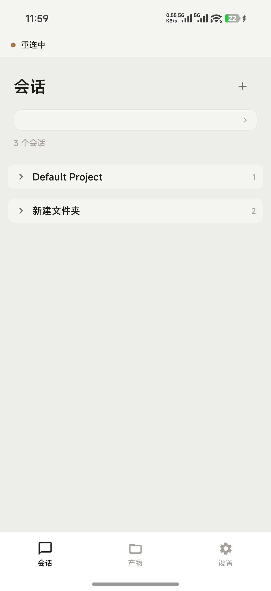
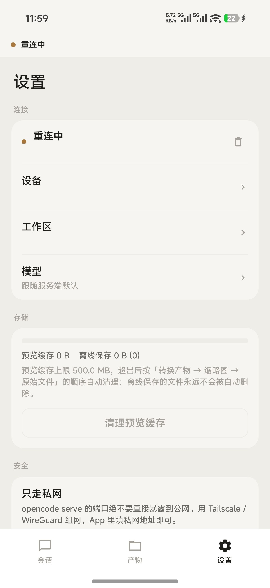

# opencode++

> A remote console for [opencode](https://opencode.ai) on your phone: talk to the agent, read its artifacts, and answer its questions — from anywhere.
>
> 手机上的 **opencode 远程控制台**：对话、看产物、批权限、答提问。
> `++` 是自增运算符 —— 它不是 opencode 的替代品，是给 opencode 加上的那个 1。开发代号 **Pod**。

[English](#english) · [快速开始](#3-快速开始) · [构建](#5-构建) · [License](#8-license-与商标声明)

现成的安装包在 [Releases](https://github.com/a5130600/opencode-plusplus/releases) 里，不想折腾工具链的话直接下载那个 APK。

---

## 界面

| 会话 | 产物 | 设置 |
|---|---|---|
|  |  |  |

> 截图中的设备地址、机器名与本地路径已做脱敏处理。

---

## 1. 它是什么

电脑上跑着 **opencode 桌面版**（v2），它是真正干活的 agent。这个 App 不参与执行 ——
它只是把桌面版那套 HTTP API 变成一块手机屏：**在外面也能看见它在干什么、插一句话、替它做个决定。**

一句话边界：**手机上做决策，不做编辑。**

### 它现在能做的

| | |
|---|---|
| **对话** | 流式输出、Markdown + KaTeX 公式渲染、附件（「让 AI 读这个文件」）、发送失败可重试 |
| **会话** | 按工作目录分组折叠（当前工作区排最前）、新建会话时指定工作区、删除会话（与电脑端同步） |
| **产物** | 按设备浏览电脑上的文件树，支持 docx / xlsx / 代码 / 图片预览，可分享出去 |
| **权限审批** | 电脑上要你确认时**全局弹窗 + 通知栏**，可直接批准一次 / 始终允许 / 拒绝 |
| **回答提问** | agent 跑到一半问你问题时（v2 里叫 form），同样全局弹窗 + 通知，支持选项 / 多选 / 自填 / 跳过 |
| **连接管理** | 多设备切换、模型切换、缓存占用统计与一键清缓存 |

### 当前版本还没做到的

- **不在手机上运行 agent** —— 执行始终在电脑上
- **暂不支持 pptx 与旧版 .doc / .xls 的预览** —— 这些文件目前只能用「让 AI 读」或分享出去给其它应用打开
- **不支持在手机上编辑文件、改动 diff** —— 这版做的是审阅与决策

---

## 2. 前置条件

三条链路之外依赖三样东西，缺一不可：

1. **电脑上跑着 opencode 桌面版 v2**（实测 2.0.11）。注意：npm 上的 `opencode-ai` 是 **v1 CLI**，是另一回事 —— App 只认 v2 契约。
2. **一个转发器**。桌面版只绑 `127.0.0.1:49374`，手机够不着。
   本仓库自带一个用户态的小转发脚本 `tools/tcp_forward.py`，不需要管理员权限、不动系统配置，
   起进程干活、杀进程收工。愿意的话也可以用 `netsh portproxy`（需管理员）。
3. **Basic Auth 凭据**。用户名固定 `opencode`，密码在电脑端的 service 配置里：
   Windows 实测路径为 `~/.config/opencode/service.json`（password）与 `~/.local/state/opencode/service.json`（url）；
   其它系统请在同一套 XDG 目录下找。App 把密码存进 **Android Keystore**（不是明文 preferences）。

> **要不要让手机从外网进来？** 那就不是转发器能解决的事了 —— 本机若处在运营商
> CGNAT 之后（没有公网 IPv4），路由器端口转发与 DDNS 都无从下手，只能靠打洞或隧道。
> 实践中最省事的是 Tailscale：手机与电脑同装，App 里直接填它的 `100.x.y.z`，
> 转发脚本不变（`0.0.0.0` 天然覆盖那块网卡）。两个当天就会撞到的坑：
> ① Windows 防火墙常把这块网卡归成「公用网络」而拦掉入站，需要在管理员终端里
> `Set-NetConnectionProfile -InterfaceAlias "Tailscale" -NetworkCategory Private`；
> ② 电脑休眠会让隧道断一会儿，长期跑建议关休眠。

---

## 3. 快速开始

### 3.1 电脑侧：把端口放出来

```bash
python tools/tcp_forward.py            # 0.0.0.0:4096 → 127.0.0.1:49374
python tools/tcp_forward.py 4096 49374 # 显式写法（监听端口 / 目标端口 / 目标主机）
```

探活：浏览器打开 `http://127.0.0.1:4096/api/info`，返回版本号即为通。
（**别**再去试 `/global/health` —— v2 里没有这个端点。）

### 3.2 手机侧：装 App，加设备

在 App 的「设置 → 设备」里新增一台：

- 主机 / 端口：同一局域网就填 `192.168.x.x` + `4096`；走 Tailscale 就填它的 `100.x.y.z`
- 用户名：`opencode`
- 密码：上一步拿到的那个

### 3.3 三步跑通

会话列表出来了 → 进一个会话发句话 → 让它在电脑上改个文件，看手机上：
文件能不能在产物页打开、冲突时有没有弹权限。三件事都成立，链路就通了。

---

想先看界面而不先编译？浏览器直接打开 [`prototype/index.html`](prototype/index.html) ——
一个自包含的可交互原型（数据是假的，不需要连任何电脑）。

---

## 4. 架构

零后端。App 直连桌面版，中间没有任何自建服务器 —— 这既是简化，也是隐私边界：
**代码与对话内容从头到尾只经过「你的电脑 ↔ 你的手机」。**

```
┌── 手机 App ─────────────────────────┐        ┌─ 你的电脑 ──────────────┐
│ core → data → di → service → ui     │        │ opencode 桌面版 v2      │
│ Room 缓存 + Keystore 凭据           │  HTTP  │ 127.0.0.1:49374         │
│ 前台服务（轮询 + 通知 + SSE 保活）  │ ◄────► │ （经转发器放出来的 4096）│
└─────────────────────────────────────┘        └─────────────────────────┘
```

四条主干链路（v2）：

| 用途 | 端点 |
|---|---|
| 发消息 | `POST /api/session/{id}/prompt` |
| 事件流 | `GET /api/event`（SSE，`readTimeout = 0`） |
| 读文件/看改动 | `GET /api/session/{id}/diff`、`/api/fs/read/*` |
| 答复挂起交互 | `POST /api/session/{id}/permission/{reqID}/reply`（审批）、`/api/session/{id}/form/{id}/reply`（提问）、`DELETE .../form/{id}`（跳过） |

三条踩过的坑，改代码前请先看（都写在对应文件的注释里）：

1. **fs 接口是 location 沙箱**：`/api/fs/read|list|find` 必须带 `?location[directory]=<绝对路径>`，
   目标路径落在沙箱外一律 500。
2. **同一概念两种形状**：prompt/inbox 事件用 `{type,payload}`，消息列表是平铺字段。按 payload 读列表 = 全空。
3. **别只信契约 JSON 的字面**：同一概念在真实响应里可能换形状。
   `/api/project` 的项目对象里**没有 `directory`**，路径字段叫 `canonical`；
   响应有时是裸数组、有时又包一层 `{location,data}` ——
   绑死一种写法的结果不是报错，而是被解析层静默吞成一个空列表。

完整接口清单与端点表：[`docs/reference/opencode-v2-endpoints.md`](docs/reference/opencode-v2-endpoints.md)、
[`opencode-v2-openapi.json`](docs/reference/opencode-v2-openapi.json)。

> 想先看代码怎么分层的：从 `core → data → di → service → ui` 顺着读包结构即可，
> 依赖关系就是目录顺序，没有隐藏的跨层调用。

---

## 5. 构建

```bash
cd android
# local.properties 里指好 sdk.dir（该文件已在 .gitignore 中）
./gradlew assembleDebug
```

要求 JDK 17。工具链版本是刻意钉死的，升级前请先读 `gradle/libs.versions.toml` 里的注释：

| | |
|---|---|
| AGP / Gradle | 8.7.3 / 8.9 |
| Kotlin / KSP | 2.0.20 / 2.0.20-1.0.25 |
| Compose BOM | 2024.09.00 |
| Hilt | 2.52 |
| Room | 2.6.1 |
| minSdk / targetSdk | 26 / 35 |

debug 包会带上 `.debug` 的 applicationId 后缀，与正式包可共存。

---

## 6. 安全须知

- **转发端口没有自己的鉴权**：4096 上站着的仍是 opencode 的 Basic Auth。密码强度就是唯一防线，请用强随机串。
- **不要把 4096 裸露到公网**。要外网访问就用 Tailscale 之类的隧道 —— 即使是 Tailscale，也要确认
  防火墙没有把那块网卡归成「公用网络」而拦掉入站。
- App 侧凭据进 **Android Keystore**；数据库里只是每台设备的消息与文件缓存，设置页可一键清掉。
- 本仓库在提交前已清掉本机专属信息（内网 IP、Tailscale 地址、调试转储）。

---

## 7. 已知边界

- 模型列表目前只在连接建立时拉一次，**换设备后要重启 App 才刷新**。
- 多公式的长回答在冷启动时仍有等待感 —— 已用错峰挂载压过一轮，彻底解法是 WebView 池化。

接口素材在 [`docs/reference/`](docs/reference/)（端点表、OpenAPI 契约、一次真实的事件序列）。

---

## 8. License 与商标声明

本项目代码以 **MIT License** 发布，见 [`LICENSE`](LICENSE)。

**本项目不是 opencode 官方项目**，与 opencode 的开发者没有任何隶属或背书关系。

应用图标与 `docs/assets/opencode-favicon.svg` 取自 [opencode.ai](https://opencode.ai) 的官方标识
（`favicon.svg`），用于表明「这是给哪一个工具做的客户端」这一事实陈述，其商标权利仍归原作者所有。
若你不希望在此处看到该标识，把 `res/drawable/ic_launcher_foreground.xml`、
`res/drawable/ic_stat_opencode.xml` 与 `res/values/colors.xml` 里的
`ic_launcher_background` 换成自己的即可。

---

## English

**opencode++** (codename *Pod*) is an Android client for the [opencode](https://opencode.ai) desktop app (v2).
Your computer runs the agent; this app is only a remote console — **decisions on the phone, execution on the computer.**

It streams conversations (Markdown + KaTeX), browses and previews files produced by the agent
(docx / xlsx / code / images), answers permission prompts and agent questions from anywhere
via a global dialog plus notifications, and needs **no backend of its own** — the app talks to your
desktop over plain HTTP with Basic Auth.

Requirements: opencode desktop v2 running, a port forwarder (the desktop app binds `127.0.0.1:49374` only —
see `tools/tcp_forward.py`), and its Basic Auth credentials (user `opencode`, password from the local service config).

See the Chinese sections above for architecture, build instructions, and security notes. Contributions welcome via issue / PR.

---

<sub>Built with Jetpack Compose · v0.1.0</sub>
